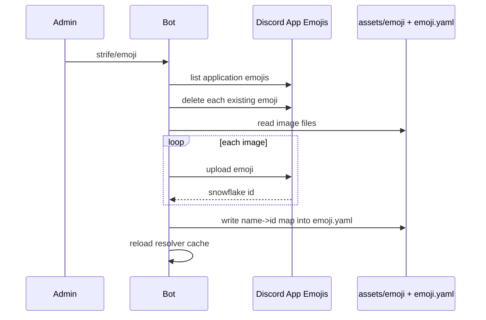

# 02 - Configuration & Emoji Assets

Loaders for the three on-disk config files and the emoji resolution / synchronization layer (Architecture section 7). Depends on [01-foundation.md](01-foundation.md).

---

## 1. Config files (Decision D7)

Three files in `config/`, plus secrets in `.env` (handled in [01](01-foundation.md)).

- `config/games.yaml` - per-game static behavioral config that operators tune without code changes.
- `config/text.toml` - user-facing strings (titles, prompts, error text), centralized for consistency and future i18n.
- `config/emoji.yaml` - the resolved emoji mapping cache, rewritten by the `strife/emoji` admin command.

`AppConfig` is a frozen container holding all three, loaded once at startup and stored on the bot.

```python
@dataclass(frozen=True)
class AppConfig:
    games: GamesConfig          # from games.yaml
    text: TextConfig            # from text.toml
    emoji: EmojiConfig          # from emoji.yaml (raw mapping; resolver wraps it)
```

---

## 2. `config/games.yaml`

Operator-tunable knobs keyed by game key. The game's code provides defaults; YAML overrides them (timers, enabled flag, accent color, default settings). This is distinct from the in-code registry metadata ([06](06-game-engine-api.md)).

```yaml
defaults:
  turn_timeout_seconds: 90
  turn_warning_seconds: 30        # warn this many seconds before timeout
  accent_color: 0x5865F2

games:
  tictactoe:
    enabled: true
    accent_color: 0x57F287
    turn_timeout_seconds: 60
  mafia:
    enabled: true
    accent_color: 0xED4245
    turn_timeout_seconds: 120
    settings_overrides:
      mafia_count_default: 2
```

Loader `strife/config/games.py`:

```python
class GameConfig(BaseModel):
    enabled: bool = True
    accent_color: int
    turn_timeout_seconds: int
    turn_warning_seconds: int
    settings_overrides: dict[str, Any] = {}

class GamesConfig(BaseModel):
    defaults: GameDefaults
    games: dict[str, GameConfig]
    def for_game(self, key: str) -> GameConfig: ...   # merges defaults
```

---

## 3. `config/text.toml`

User-facing strings, namespaced by area. Read with stdlib `tomllib`. Supports `{}`-style named placeholders resolved at call sites.

```toml
[common]
game_ended = "This game has already ended."
not_your_turn = "It is not your turn."
forbidden = "You are not allowed to do that."

[lobby]
title = "{game_name} Lobby"
waiting = "Waiting for players ({count}/{max})..."
ready = "Ready"

[errors]
already_in_session = "You are already in an active lobby or match."
```

Loader `strife/config/text.py`:

```python
class TextConfig:
    def get(self, key: str, **fmt) -> str: ...   # key = "lobby.title"; .format(**fmt)
```

Missing-key behavior: raise in tests, log + return the key string in production (never crash a render over a missing string).

---

## 4. Emoji resolution (Architecture section 7)

Emojis are decoupled from code via semantic names resolved to platform strings, with unicode fallback.

### 4.1 `config/emoji.yaml`

Three dictionaries (section 7):

```yaml
general:
  brand_logo:        { fallback: "🎮", id: null }
  success_checkmark: { fallback: "✅", id: null }
  error_cross:       { fallback: "❌", id: null }
  separator_bar:     { fallback: "➖", id: null }
button:
  play:          { fallback: "▶️", id: null }
  previous:      { fallback: "◀️", id: null }
  next:          { fallback: "▶️", id: null }
  external_link: { fallback: "🔗", id: null }
  configure:     { fallback: "⚙️", id: null }
game:
  tictactoe_x:     { fallback: "❌", id: null }
  tictactoe_o:     { fallback: "⭕", id: null }
  mafia_villager:  { fallback: "🧑\u200d🌾", id: null }
  mafia_werewolf:  { fallback: "🐺", id: null }
```

Each entry stores a unicode `fallback` and an optional custom-emoji `id` (snowflake). The `id` is populated by sync (Section 5) and persisted back to this file.

### 4.2 Resolver - `strife/presentation/emoji.py`

```python
class EmojiResolver:
    def __init__(self, config: EmojiConfig): ...
    def resolve(self, name: str) -> str:
        # returns "<:name:snowflake>" if id set, else the unicode fallback
    def general(self, name: str) -> str: ...
    def button(self, name: str) -> str: ...
    def game(self, key: str, name: str) -> str:   # name e.g. "tictactoe_x"
    async def sync(self, bot, home_guild_id: int) -> EmojiConfig:
        # see Section 5; returns updated mapping
```

The resolved mapping is cached in memory at startup so games fetch icons synchronously and instantly. `resolve` accepts an unknown name by returning a neutral placeholder (e.g. the `error_cross` fallback) and logging a warning.

---

## 5. Dynamic emoji synchronization

Run at startup (step 7 of `setup_hook`) and on demand via `strife/emoji`.

### Startup sync (`EmojiResolver.sync`, non-destructive)

1. Fetch the application's uploaded emojis (`bot.fetch_application_emojis()`), building `{name: snowflake}`.
2. For each entry in `emoji.yaml`, if a custom emoji with the same name exists, set its `id`; otherwise leave `id = null` (the unicode fallback is used).
3. Cache the resolved mapping in memory. Startup sync does **not** upload or delete anything.

### `strife/emoji` admin command (destructive re-upload, [09](09-commands.md))

1. Fetch the bot's current application emojis.
2. Delete all existing custom application emojis.
3. Iterate image files under `assets/emoji/` (filename stem = semantic name), upload each as an application emoji, capture the returned snowflake.
4. Write the updated `{name: id}` mapping back into `config/emoji.yaml` (preserving each entry's `fallback`).
5. Reload the in-memory resolver from the new file.

YAML writer must preserve `fallback` values and key ordering where practical (use `yaml.safe_dump` with `sort_keys=False`).



---

## 6. Owners list

The privileged owners list is `settings.owner_ids` from `.env` ([01](01-foundation.md)). The admin command listener checks membership against this tuple. Documented here so all config sources are in one place.

---

## 7. Deliverables checklist

- [ ] `config/games.yaml` + `strife/config/games.py` (`GamesConfig`, `for_game` merge).
- [ ] `config/text.toml` + `strife/config/text.py` (`TextConfig.get`).
- [ ] `config/emoji.yaml` seeded with general/button/game entries + unicode fallbacks.
- [ ] `strife/presentation/emoji.py` (`EmojiResolver` with resolve/general/button/game/sync).
- [ ] `assets/emoji/` directory convention (filename stem = semantic name).
- [ ] `AppConfig` aggregate + loader invoked from `setup_hook` step 3.
- [ ] Startup non-destructive sync; destructive re-upload wired to `strife/emoji` ([09](09-commands.md)).
