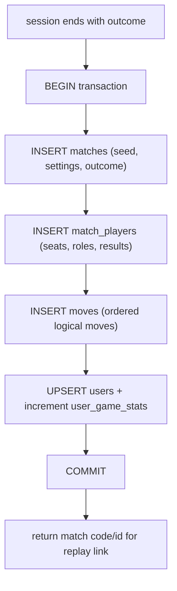

# 03 - Persistence

PostgreSQL access via `asyncpg`, plain `.sql` migrations, schema DDL, and repository wrappers. Per Decision D4 we persist only **finished** matches, their recorded **moves**, per-guild config, and per-user win/loss aggregates - there is **no** live game-state table and **no** feedback table. Depends on [01-foundation.md](01-foundation.md).

---

## 1. Connection pool - `strife/persistence/pool.py`

```python
async def create_pool(database_url: str) -> asyncpg.Pool:
    return await asyncpg.create_pool(
        dsn=database_url,
        min_size=2,
        max_size=10,
        init=_init_connection,   # register JSONB codec
    )

async def _init_connection(conn: asyncpg.Connection) -> None:
    await conn.set_type_codec(
        "jsonb", encoder=json.dumps, decoder=json.loads, schema="pg_catalog",
    )
```

- Single pool stored on `bot.pool`; all queries run through it (native async; no thread-pool offloading, per Architecture section 4).
- JSONB columns transparently encode/decode Python dict/list.
- Repositories acquire connections per call; multi-statement writes use `async with conn.transaction()`.

---

## 2. Migrations - `strife/persistence/migrator.py`

A minimal forward-only runner (no ORM, no Alembic).

- A `schema_migrations(version TEXT PRIMARY KEY, applied_at TIMESTAMPTZ DEFAULT now())` table tracks applied files.
- On startup, list `migrations/*.sql` sorted by filename, skip already-applied versions, and apply each remaining file inside a transaction, then record its version.
- Version = filename stem (e.g. `0001_init`).

```python
class Migrator:
    def __init__(self, pool: asyncpg.Pool, migrations_dir: Path): ...
    async def run(self) -> list[str]:   # returns newly applied versions
```

---

## 3. Schema - `migrations/0001_init.sql`

```sql
CREATE TABLE IF NOT EXISTS guilds (
    guild_id           BIGINT PRIMARY KEY,
    default_channel_id BIGINT,
    created_at         TIMESTAMPTZ NOT NULL DEFAULT now(),
    updated_at         TIMESTAMPTZ NOT NULL DEFAULT now()
);

CREATE TABLE IF NOT EXISTS matches (
    id          BIGSERIAL PRIMARY KEY,        -- ResourceID used in replay custom_ids
    code        TEXT UNIQUE NOT NULL,         -- short shareable match code
    game_key    TEXT NOT NULL,
    guild_id    BIGINT NOT NULL REFERENCES guilds(guild_id),
    thread_id   BIGINT,
    seed        BIGINT NOT NULL,              -- RNG seed for deterministic re-simulation (D12)
    settings    JSONB NOT NULL DEFAULT '{}',  -- match settings chosen in lobby
    status      TEXT NOT NULL,                -- 'completed' | 'abandoned'
    outcome     JSONB NOT NULL DEFAULT '{}',  -- winner(s)/summary, game-defined shape
    total_turns INT NOT NULL DEFAULT 0,
    created_at  TIMESTAMPTZ NOT NULL DEFAULT now(),
    started_at  TIMESTAMPTZ,
    ended_at    TIMESTAMPTZ
);
CREATE INDEX IF NOT EXISTS matches_guild_created_idx ON matches (guild_id, created_at DESC);
CREATE INDEX IF NOT EXISTS matches_game_idx          ON matches (game_key);

CREATE TABLE IF NOT EXISTS match_players (
    match_id       BIGINT NOT NULL REFERENCES matches(id) ON DELETE CASCADE,
    seat_index     INT NOT NULL,
    user_id        BIGINT,                    -- NULL when the seat is a bot
    is_bot         BOOLEAN NOT NULL DEFAULT FALSE,
    bot_difficulty TEXT,
    display_name   TEXT NOT NULL,             -- snapshot at match time
    role_key       TEXT,                      -- assigned role, if any
    result         TEXT,                      -- 'win' | 'loss' | 'draw' | 'forfeit'
    PRIMARY KEY (match_id, seat_index)
);
CREATE INDEX IF NOT EXISTS match_players_user_idx ON match_players (user_id);

CREATE TABLE IF NOT EXISTS moves (
    id         BIGSERIAL PRIMARY KEY,
    match_id   BIGINT NOT NULL REFERENCES matches(id) ON DELETE CASCADE,
    turn_index INT NOT NULL,                  -- 0-based ordering for replay
    actor_seat INT,                           -- NULL for system-generated moves
    source     TEXT NOT NULL,                 -- move id / slash-move name / component source
    arguments  JSONB NOT NULL DEFAULT '{}',   -- concrete move args (D12)
    created_at TIMESTAMPTZ NOT NULL DEFAULT now(),
    UNIQUE (match_id, turn_index)
);

CREATE TABLE IF NOT EXISTS users (
    user_id      BIGINT PRIMARY KEY,
    display_name TEXT,
    first_seen   TIMESTAMPTZ NOT NULL DEFAULT now(),
    last_seen    TIMESTAMPTZ NOT NULL DEFAULT now()
);

CREATE TABLE IF NOT EXISTS user_game_stats (
    user_id  BIGINT NOT NULL REFERENCES users(user_id) ON DELETE CASCADE,
    game_key TEXT   NOT NULL,
    wins     INT NOT NULL DEFAULT 0,
    losses   INT NOT NULL DEFAULT 0,
    draws    INT NOT NULL DEFAULT 0,
    played   INT NOT NULL DEFAULT 0,
    PRIMARY KEY (user_id, game_key)
);
```

Design notes:

- `matches.id` is the integer ResourceID embedded in replay `custom_id`s ([05](05-interaction-routing.md)).
- `moves` stores only **logical** moves + the match-level `seed`; replay re-runs the engine to reproduce frames (D12). Bot and AFK-resolved moves are recorded as concrete moves so re-simulation never needs to recompute AI decisions.
- `outcome` and `settings` are JSONB so each game defines its own shape without schema churn.
- `user_game_stats` enables `/strife profile [user] [game]`; cross-game totals are a `SUM`. It is fully rebuildable from `match_players`, so it is a cache, not a source of truth.

---

## 4. Repositories - `strife/persistence/repositories/`

Thin, typed wrappers. No business logic; callers compose them inside transactions when needed.

### `guilds.py`

```python
class GuildRepository:
    async def upsert(self, guild_id: int) -> None
    async def set_default_channel(self, guild_id: int, channel_id: int) -> None
    async def get_default_channel(self, guild_id: int) -> int | None
```

### `matches.py`

```python
class MatchRepository:
    async def create_finished(self, record: FinishedMatch) -> int   # returns match id
    async def get(self, ref: str | int) -> MatchDetail | None        # by id OR code
    async def list_recent(self, guild_id: int, *, limit: int, offset: int) -> list[MatchSummary]
    async def list_for_user(self, user_id: int, game_key: str | None,
                            *, limit: int, offset: int) -> list[MatchSummary]
```

`create_finished` inserts the match, its `match_players`, and all `moves` in **one transaction**, generating a unique `code` (retry on collision).

### `moves.py`

```python
class MoveRepository:
    async def list_for_match(self, match_id: int) -> list[MoveRecord]   # ordered by turn_index
```

### `users.py`

```python
class UserRepository:
    async def touch(self, user_id: int, display_name: str) -> None      # upsert users
    async def apply_results(self, results: list[PlayerResult], game_key: str) -> None
    async def get_stats(self, user_id: int, game_key: str | None) -> UserStats
```

`apply_results` increments `user_game_stats` for each human player; it runs in the same transaction as `create_finished` so a finished match and its stat deltas commit atomically.

---

## 5. Match finalization flow

When a session ends ([06](06-game-engine-api.md), [08](08-session-lifecycle.md)):



Abandoned matches (no resolution) may be stored with `status='abandoned'` and empty `outcome` for history, or skipped entirely - decide per [08](08-session-lifecycle.md); default is to store abandoned matches that had at least one move so replays still work.

---

## 6. Match code generation

- Short, human-shareable, URL-safe: 6 chars from an unambiguous base32 alphabet (no `0/O/1/I`).
- Generate, attempt insert, retry on unique-violation (bounded retries).
- `MatchRepository.get` accepts either the integer id or the code string.

---

## 7. `strife/dbreset` support

The `dbreset` admin command ([09](09-commands.md)) drops and recreates all tables. Provide a `migrations/reset.sql` (DROP TABLE IF EXISTS ... CASCADE for all tables incl. `schema_migrations`) that the command runs, then re-invokes the `Migrator`. Tables dropped: `user_game_stats`, `users`, `moves`, `match_players`, `matches`, `guilds`, `schema_migrations`.

---

## 8. Deliverables checklist

- [ ] `strife/persistence/pool.py` (`create_pool` + JSONB codec).
- [ ] `strife/persistence/migrator.py` (`Migrator` + `schema_migrations`).
- [ ] `migrations/0001_init.sql` (DDL above) and `migrations/reset.sql`.
- [ ] Repositories: `guilds.py`, `matches.py`, `moves.py`, `users.py` with the signatures above.
- [ ] Atomic `create_finished` (match + players + moves + stat deltas in one transaction).
- [ ] Match-code generator with collision retry.
