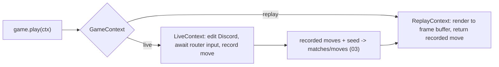

# 06 - Game Engine & Plugin API

The contract every game implements: static registry metadata (Architecture section 1), the `GameSession` runtime, the game-facing `GameContext` (the Components V2 surface from section 2 in action), the deterministic move-recording model that powers replay (Decision D12), and the bot callback model (Decision D13). This is the heart of the platform. Depends on [03](03-persistence.md), [04](04-presentation-components-v2.md), [05](05-interaction-routing.md).

---

## 1. Design model

A game is a **stateful, per-match object** whose `play()` coroutine drives the entire match. It never touches Discord or the database directly; it only:

- reads `ctx.players`, `ctx.settings`, and `ctx.rng` (the single source of randomness),
- builds Strife `LayoutView`s ([04](04-presentation-components-v2.md)),
- calls `ctx.update(...)` to show state and `ctx.request_input(...)` to await a move,
- returns a `GameOutcome`.

The same `play()` runs under two `GameContext` implementations - **live** (waits on real interactions, edits Discord) and **replay** (feeds recorded moves, captures frames). Because all randomness flows through `ctx.rng` (seeded by the match `seed`) and all decisions (including bot and AFK-resolved moves) are recorded, re-running `play()` reproduces the match exactly. This is what makes Decision D12 (replay by re-simulation) sound.



---

## 2. Registry metadata (Architecture section 1)

`strife/engine/metadata.py` - immutable dataclasses a game advertises.

```python
class RoleMode(StrEnum):  NONE="none"; RANDOM="random"; CHOSEN="chosen"; SECRET="secret"
class RoleFlow(StrEnum):  NONE="none"; SELECTABLE="selectable"; RANDOM="random"; SELECTABLE_RANDOM="selectable_random"
class PlayerOrder(StrEnum): RANDOM="random"; JOINED="joined"; CREATOR_FIRST="creator_first"; REVERSED="reversed"
class OptionType(StrEnum): BOOL="bool"; INT="int"; CHOICE="choice"
class ParamType(StrEnum):  STRING="string"; INT="int"; CHOICE="choice"

@dataclass(frozen=True)
class PlayerCount:
    fixed: int | None = None
    allowed: tuple[int, ...] | None = None
    minimum: int | None = None
    maximum: int | None = None
    def is_valid(self, n: int) -> bool: ...

@dataclass(frozen=True)
class SettingOption:
    key: str; title: str; description: str; type: OptionType
    default: Any
    minimum: int | None = None; maximum: int | None = None       # INT bounds
    choices: tuple[str, ...] | None = None                       # CHOICE values

@dataclass(frozen=True)
class MoveParam:
    name: str; type: ParamType; required: bool = True
    choices: tuple[str, ...] | None = None
    autocomplete: Callable[..., Awaitable[list[str]]] | None = None
    reload_state: bool = False        # re-render the view after this param (state-reload directive)

@dataclass(frozen=True)
class SlashMove:
    name: str; description: str; params: tuple[MoveParam, ...] = ()

@dataclass(frozen=True)
class RoleSpec:
    key: str; name: str; instructions: str

@dataclass(frozen=True)
class BotSpec:
    difficulty: str; description: str     # the move callback lives on the Game (Section 5)

@dataclass(frozen=True)
class GameMetadata:
    # identity & visuals
    key: str; name: str; summary: str; description: str; tags: tuple[str, ...]
    # developer context
    author: str; version: str; author_link: str | None; source_link: str | None
    # playability
    time_estimate: str; difficulty: str
    # constraints
    player_count: PlayerCount; player_order: PlayerOrder
    # bots & settings & moves
    bots: tuple[BotSpec, ...] = ()
    settings: tuple[SettingOption, ...] = ()
    slash_moves: tuple[SlashMove, ...] = ()
    # roles
    role_mode: RoleMode = RoleMode.NONE
    role_flow: RoleFlow = RoleFlow.NONE
    roles: tuple[RoleSpec, ...] = ()
    # capabilities (Decision D10)
    supports_player_removal: bool = False
    # accent color may be overridden by games.yaml (02)
    accent_color: int | None = None

    @property
    def supports_bots(self) -> bool: return bool(self.bots)
```

Note: the architecture's **Peek Callback** is removed (spectator/peek cut). The **Role Validation Hook** is kept as `Game.validate_roles` (Section 4).

---

## 3. The `Game` plugin base - `strife/engine/game.py`

```python
class Game(ABC):
    metadata: ClassVar[GameMetadata]

    def __init__(self, players: list[Player], settings: Mapping[str, Any], rng: random.Random):
        self.players = players          # seats with roles already assigned
        self.settings = settings
        self.rng = rng                  # seeded; the ONLY randomness source
        # subclasses initialize their board/phase/role state here

    @abstractmethod
    async def play(self, ctx: GameContext) -> GameOutcome: ...

    # required iff metadata.supports_bots
    async def bot_move(self, difficulty: str, seat: int) -> Move:
        raise NotImplementedError

    # required iff metadata.supports_player_removal (Decision D10)
    def remove_player(self, seat: int) -> None:
        raise NotImplementedError

    # role validation hook (lobby start gate); default accepts
    def validate_roles(self, assignment: dict[int, str]) -> tuple[bool, str | None]:
        return True, None
```

A fresh `Game` instance is created per match by the registry. Its attributes are the authoritative game state.

---

## 4. Roles - `strife/engine/roles.py`

Role assignment happens at match start, driven by `role_mode` / `role_flow`:

- `RoleMode.NONE` -> no roles.
- `RoleMode.RANDOM` -> shuffle roster onto seats using `rng` (recorded via seed, so reproducible).
- `RoleMode.CHOSEN` -> seats pick in the lobby (role_flow `selectable`); `validate_roles` gates start.
- `RoleMode.SECRET` -> assigned randomly via `rng` but hidden; revealed only through `ctx.send_private`.

`assign_roles(metadata, players, lobby_selection, rng) -> dict[seat, role_key]` centralizes this and is called before `Game.__init__` so `players` carry roles. Because secret/random assignment uses the match `rng` (seed), replay reproduces identical roles.

---

## 5. `GameContext` - `strife/engine/context.py`

The game-facing surface. Two implementations, one interface.

```python
@dataclass
class Move:
    actor_seat: int | None; source: str; args: dict

class GameContext(Protocol):
    rng: random.Random
    players: Sequence[Player]
    settings: Mapping[str, Any]

    def is_bot(self, seat: int) -> bool: ...

    async def update(self, view: LayoutView) -> None:
        """Render the public board; no input awaited. Recorded as a frame."""

    async def request_input(self, view: LayoutView, *, actor: int,
                            sources: set[str] | None = None) -> Move:
        """Show view, await a valid move from one seat. Bot seats auto-resolve
        via Game.bot_move. Returns the move; engine records it (turn_index++)."""

    async def request_inputs(self, view: LayoutView, *, actors: set[int],
                             sources: set[str] | None = None,
                             until: Literal["all", "any"] = "all") -> dict[int, Move]:
        """Multiple seats act (e.g. simultaneous voting). Bot seats resolve
        immediately; humans awaited until `until` satisfied or AFK resolution."""

    async def send_private(self, seat: int, view: LayoutView) -> None:
        """Private/ephemeral view to one seat (secret roles). Recorded per-seat."""
```

### 5.1 Live context (`LiveContext`)

- `update` -> `surface.update(view)` ([04](04-presentation-components-v2.md)); appends a frame marker.
- `request_input`:
  1. If `is_bot(actor)`: `move = await self.session.game.bot_move(difficulty, actor)` (CPU-heavy search via `asyncio.to_thread`), render the view (so spectators of the thread see the move), record, return.
  2. Else: `surface.update(view)`, register a `PendingInput(allowed_actors={actor}, allowed_sources=sources, future)`, set `last_move_at = now`, `move = await future`, record, clear pending, return.
- `request_inputs`: resolve all bot seats immediately; create one future per human seat; await per `until`; the AFK scheduler may resolve individual humans (Section 7 / [08](08-session-lifecycle.md)).
- `send_private` -> ephemeral message to that user via a private `ViewSurface` (best-effort; if the user has DMs closed, fall back to an ephemeral on their next interaction).
- Move recording: every resolved `Move` is appended to `session.recorded_moves` with an incrementing `turn_index`; this list (+ seed + settings) is what gets persisted on finish ([03](03-persistence.md)).

### 5.2 Replay context (`ReplayContext`, [10](10-replay-and-profile.md))

- `update` / `request_input` / `request_inputs` render into an in-memory **frame buffer** (capturing the Strife `LayoutView` with all interactive items disabled) instead of editing Discord.
- `request_input(s)` returns the **next recorded move(s)** in order (including the original bot/AFK moves) - it never recomputes a bot decision and never waits.
- `send_private` frames are captured per seat; the public replay viewer shows public frames (private content may be surfaced in match detail or revealed in the final frame, per game).
- The result is an ordered list of frames the replay viewer paginates over.

---

## 6. `GameSession` - `strife/engine/session.py`

The live runtime for one match.

```python
@dataclass
class PendingInput:
    allowed_actors: set[int]
    allowed_sources: set[str] | None
    future: asyncio.Future[Move]

class GameSession:
    id: int                      # == thread_id (ResourceID for g_move/g_select, 05)
    game: Game
    ctx: LiveContext
    players: list[Player]
    settings: dict
    seed: int
    surface: ViewSurface
    lock: asyncio.Lock
    pending: dict[int, PendingInput]   # seat -> pending (supports request_inputs)
    recorded_moves: list[Move]
    last_move_at: float
    task: asyncio.Task               # runs game.play(ctx)

    async def start(self) -> None         # launch play() task, wire completion
    async def submit(self, inp: InteractionInput) -> None   # router entrypoint
    async def force_move(self, seat: int, move: Move) -> None  # AFK/bot injection (08)
    async def cancel(self, reason: str) -> None             # forfeit/abandon
```

`submit(inp)` (called by the router under no global lock; uses `self.lock`):

1. Acquire `self.lock`.
2. Find `pending[seat]` for the actor's seat; if none -> reply `not_your_turn`.
3. Validate `inp.source` against `allowed_sources`; validate the actor owns that seat.
4. Build `Move(actor_seat, inp.source, inp.args)`; set `future.set_result(move)`; remove from `pending`.
5. The `play()` coroutine resumes, processes the move, and either ends or registers the next `request_input`.
6. Ack handled by the router (defer); the resumed game code edits the message via `ctx.update` if needed.

Completion: when `play()` returns a `GameOutcome`, the session disables the board (`surface.disable_all`), persists the finished match ([03](03-persistence.md)), posts a results view with a Rematch button ([08](08-session-lifecycle.md)), unregisters from the registries ([07](07-matchmaking-and-lobby.md)), and clears the per-user locks.

```mermaid
flowchart TD
    start["session.start -> task=play(ctx)"] --> ri["ctx.request_input -> register pending, await future"]
    ri --> click["router.submit resolves future"]
    click --> resume["play resumes, applies move, records it"]
    resume --> more{game over?}
    more -->|no| ri
    more -->|yes| out["return GameOutcome"]
    out --> fin["disable board, persist, post result + rematch"]
```

---

## 7. Bots & AFK injection

- Bot turns are transparent: any `request_input(actor=botSeat)` is resolved by `Game.bot_move`, so `play()` is written without branching on human/bot. Strength scales with `bot_difficulty` (Decision D13; see [11](11-reference-game-tictactoe.md), [12](12-reference-game-mafia.md)).
- CPU-heavy bot search runs via `asyncio.to_thread` to avoid blocking the event loop.
- The AFK scheduler ([08](08-session-lifecycle.md)) calls `session.force_move(seat, move)` to resolve a stale pending input. The injected move is recorded like any other (so replay reproduces it). Resolution policy (Decision D10): bot-swap (`game.bot_move`) if `supports_bots`; else forfeit-remove (`game.remove_player` + a `forfeit` move) if `supports_player_removal`; else `session.cancel("timeout")` ends the match.

---

## 8. Registry & creation - `strife/engine/registry.py`

```python
class GameRegistry:
    def register(self, game_cls: type[Game]) -> None        # validates metadata.key unique
    def get(self, key: str) -> type[Game]
    def metadata(self, key: str) -> GameMetadata
    def all(self) -> list[GameMetadata]                      # for /strife catalog
    def create(self, key: str, players: list[Player],
               settings: dict, seed: int) -> Game            # assigns roles, seeds rng, instantiates
```

`create` resolves defaults from `games.yaml` ([02](02-configuration-and-emoji.md)), runs `assign_roles`, builds `random.Random(seed)`, and returns the `Game` instance. Games register at startup ([01](01-foundation.md) step 6): `registry.register(TicTacToe); registry.register(Mafia)`.

---

## 9. Deliverables checklist

- [ ] `strife/engine/metadata.py` (all dataclasses + enums from Section 2).
- [ ] `strife/engine/game.py` (`Game` ABC + capability hooks).
- [ ] `strife/engine/roles.py` (`assign_roles` for all role modes/flows).
- [ ] `strife/engine/context.py` (`GameContext` protocol, `LiveContext`, `Move`).
- [ ] `strife/engine/session.py` (`GameSession`, `PendingInput`, submit/force_move/cancel + completion/finalize).
- [ ] `strife/engine/registry.py` (`GameRegistry`).
- [ ] `strife/engine/bots.py` (bot dispatch + `asyncio.to_thread` wrapper).
- [ ] Determinism guarantee: a match re-run from `seed` + recorded moves yields identical frames ([13](13-testing.md)).
