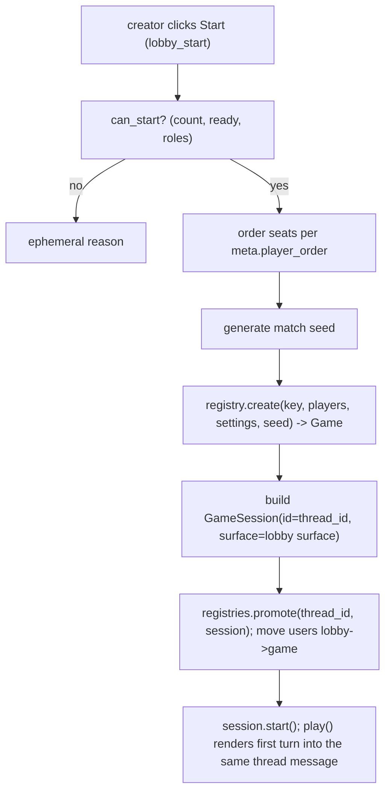

# 07 - Matchmaking & Lobby

In-memory registries (Architecture section 4), the lobby model and its lifecycle, the Matchmaking Lobby View (section 6A), and the Lobby Settings ephemeral panel (section 6B). Enforces the global single-session lock (Decision D9). Depends on [04](04-presentation-components-v2.md), [05](05-interaction-routing.md), [06](06-game-engine-api.md).

---

## 1. Registries - `strife/matchmaking/registries.py`

All live state is in-memory (Decision D4). Thread-safety on the single event loop is achieved with `asyncio.Lock`s; the maps themselves are plain dicts.

```python
@dataclass
class UserLocation:
    kind: Literal["lobby", "game"]
    thread_id: int
    guild_id: int

class SessionRegistries:
    active_games: dict[int, GameSession]        # thread_id -> session (06)
    lobbies: dict[int, Lobby]                    # thread_id -> lobby
    guild_lobbies: dict[int, set[int]]           # guild_id -> lobby thread ids
    user_location: dict[int, UserLocation]       # user_id -> location (GLOBAL, D9)
    _lock: asyncio.Lock

    async def reserve_user(self, user_id: int, loc: UserLocation) -> bool:
        """Atomically claim the global slot; False if the user is already placed."""
    async def release_user(self, user_id: int) -> None
    def location_of(self, user_id: int) -> UserLocation | None

    def add_lobby(self, lobby: Lobby) -> None
    def remove_lobby(self, thread_id: int) -> None
    def get_lobby(self, thread_id: int) -> Lobby | None
    def get_game(self, thread_id: int) -> GameSession | None
    def promote(self, thread_id: int, session: GameSession) -> None  # lobby -> game, same thread
```

- The global lock (D9): `reserve_user` guards `user_location`; a user may hold exactly one location across all guilds. Joining/creating reserves; leaving/ending/forfeiting releases.
- Lobby and game share the **same thread id** as their key (the lobby thread is promoted in place to the match thread, which also enables in-place rematch reset, [08](08-session-lifecycle.md)).

---

## 2. Lobby model - `strife/matchmaking/lobby.py`

```python
@dataclass
class QueuedBot:
    name: str            # display name, e.g. "Bot-Hard-1"
    difficulty: str

@dataclass
class LobbyMember:
    user_id: int
    display_name: str

@dataclass
class Lobby:
    thread_id: int
    guild_id: int
    channel_id: int
    game_key: str
    creator_id: int
    private: bool
    members: list[LobbyMember]
    bots: list[QueuedBot]
    ready: set[int]
    settings: dict                       # merged defaults (06 metadata + 02 yaml) then overrides
    role_selection: dict[int, str]       # user_id -> role_key (chosen/selectable modes)
    whitelist: set[int]
    blacklist: set[int]
    message_id: int
    surface: ViewSurface
    lock: asyncio.Lock

    @property
    def total_players(self) -> int: ...  # len(members)+len(bots)
    def can_start(self, meta: GameMetadata, game: Game | None) -> tuple[bool, str | None]: ...
```

`can_start` checks, in order: player count valid for `meta.player_count`; all human members `ready`; role selection complete and `validate_roles` passes (for chosen modes); caller is the creator.

---

## 3. LobbyService - `strife/matchmaking/service.py`

Holds the handlers the router delegates to for every `lobby_*` prefix ([05](05-interaction-routing.md)), plus lobby creation from `/play`.

```python
class LobbyService:
    def __init__(self, bot, registries, registry: GameRegistry, compiler, text, emoji): ...

    async def create_lobby(self, interaction, game_key: str, private: bool) -> None
    async def handle(self, route: Route, interaction) -> None   # prefix -> method
```

Handler dispatch by prefix:

- `lobby_join` -> add member (reserve global slot; enforce whitelist/blacklist), add to thread, re-render.
- `lobby_leave` -> remove member, release slot; if creator leaves, transfer or end (Section 6).
- `lobby_ready` -> toggle ready in `ready`.
- `lobby_assign` -> render/refresh the role-selection rows (or auto-distribute for `random` flow).
- `lobby_settings` -> send the ephemeral settings panel (Section 5) to the creator only.
- `lobby_start` -> validate `can_start`, then start the match (Section 7).
- `lobby_role` -> set `role_selection[user_id]` from the select value.
- `lobby_priv` / `lobby_reset_priv` -> set/reset privacy (+ whitelist/blacklist edits).
- `lobby_opt` / `lobby_reset_rules` -> set/reset a match option.
- `lobby_end` -> creator ends the lobby (release all slots, delete/lock thread or revert).

Every handler: acquire `lobby.lock`, check permissions (creator-only where required), mutate, `await interaction.response.defer()` then `surface.update(...)`. Permission/again-in-session failures reply ephemerally using `text` keys ([02](02-configuration-and-emoji.md)).

---

## 4. Lobby View (Architecture section 6A) - `strife/matchmaking/lobby_view.py`

`build_lobby_view(lobby, meta, emoji, text) -> LayoutView`:

```
## [brand_logo] {game name} Lobby
Container(accent = game accent color):
  TextDisplay: welcome / summary text (+ optional MediaGallery preview)
  Separator
  TextDisplay: Player Roster
    - <@member> (Ready / Waiting)        x each human member
    - {bot.name} ({difficulty})          x each queued bot
  [Role Selection section: Separator + title]   # only if role_flow active
ActionRow 1 (core controls):
  [Join]   custom_id lobby_join:{tid}
  [Leave]  custom_id lobby_leave:{tid}
  [Ready]  custom_id lobby_ready:{tid}
  [Assign Roles]  custom_id lobby_assign:{tid}      # only if role_flow in {selectable, selectable_random}
  [Settings]      custom_id lobby_settings:{tid}    # creator only (rendered disabled/hidden for others)
  [Start]         custom_id lobby_start:{tid}        # creator only
ActionRow 2..N (per-player role selects, if role_flow == selectable):
  [Select "<member>: Role"]  custom_id lobby_role:{tid}  payload {player_id}
    options = meta.roles (key/name/description)
```

Notes:

- The Settings and Start buttons are rendered only for the creator's view; since one shared message is shown to all, gate by disabling them and relying on the handler's creator check (a click by a non-creator returns an ephemeral `common.forbidden`). The role-selector placement may be refined (Architecture note) - default is dedicated action rows after the core controls.
- Ready status and roster update on every mutation via `surface.update`.

---

## 5. Settings Panel (Architecture section 6B) - `strife/matchmaking/settings_view.py`

Ephemeral, creator-only. `build_settings_view(lobby, meta, emoji, text) -> LayoutView`:

```
## [configure] {game name} > Configuration Settings
Container(accent):
  TextDisplay: Privacy - current {Public|Private}
  TextDisplay: Access Lists - whitelist N / blacklist M     # F3
  Separator
  TextDisplay: Match Options                                 # only if meta.settings
ActionRow: [Select "Privacy (Public / Private)"]  custom_id lobby_priv:{tid}
ActionRow: [Reset Privacy] (secondary)            custom_id lobby_reset_priv:{tid}
ActionRow (private only): [UserSelect "Whitelist"] / [UserSelect "Blacklist"]   # F3 add/remove
ActionRow x option: [Select "{option.title}"]    custom_id lobby_opt:{tid} payload {option_key}
  options derived from SettingOption (bool toggle / int scale / choice list) with current value default-selected
ActionRow: [Reset Game Rules] (secondary)         custom_id lobby_reset_rules:{tid}
ActionRow: [End Game] (danger)                    custom_id lobby_end:{tid}
```

- INT options render as a `Select` of allowed values within `[minimum, maximum]` (sampled if the range is large); BOOL as a two-choice select; CHOICE as its `choices`.
- Whitelist/blacklist (Decision F3) use `discord.ui` user-select menus; only meaningful for private lobbies (gates `lobby_join`).
- Editing an option mutates `lobby.settings` and re-renders the (ephemeral) panel; the public lobby view refreshes too.

---

## 6. Creator leave / lobby teardown

- If a non-creator leaves: remove + release slot + re-render.
- If the creator leaves and humans remain: transfer creator to the next-joined member.
- If the last human leaves (or creator ends via `lobby_end`): release all slots, remove the lobby from registries, and either lock or delete the thread (default: post a "lobby closed" notice and lock the thread).

---

## 7. Start flow (lobby -> match)



- Seat ordering applies `meta.player_order` (random uses the match `rng`); the resulting seat->player mapping is authoritative and is later persisted in `match_players` ([03](03-persistence.md)) so replay does not recompute it.
- The lobby `ViewSurface` (its message) is reused as the game's public surface, so the lobby message becomes the live board in place (no new message), preserving the thread.
- `reserve_user` entries flip from `kind="lobby"` to `kind="game"` for all human players.

---

## 8. `/play` integration

`/play [game_key] [private]` ([09](09-commands.md)) -> `LobbyService.create_lobby`:

1. Enforce global lock (`reserve_user` for the creator); reject with `errors.already_in_session` if placed.
2. Resolve target channel: guild `default_channel_id` ([03](03-persistence.md)); fallback to the invoking channel.
3. Create a thread (public, or private when `private=true`); add the creator.
4. Build the lobby, render the Lobby View as the thread's first message, register it (`add_lobby`, `guild_lobbies`).

---

## 9. Deliverables checklist

- [ ] `strife/matchmaking/registries.py` (`SessionRegistries` + global reserve/release).
- [ ] `strife/matchmaking/lobby.py` (`Lobby`, `LobbyMember`, `QueuedBot`, `can_start`).
- [ ] `strife/matchmaking/service.py` (`LobbyService` create + all `lobby_*` handlers).
- [ ] `strife/matchmaking/lobby_view.py` (section 6A builder).
- [ ] `strife/matchmaking/settings_view.py` (section 6B builder incl. whitelist/blacklist).
- [ ] Start flow promoting a lobby to a `GameSession` in place.
- [ ] Bot add/remove handlers wired to `/strife bot add|remove` ([09](09-commands.md)).
