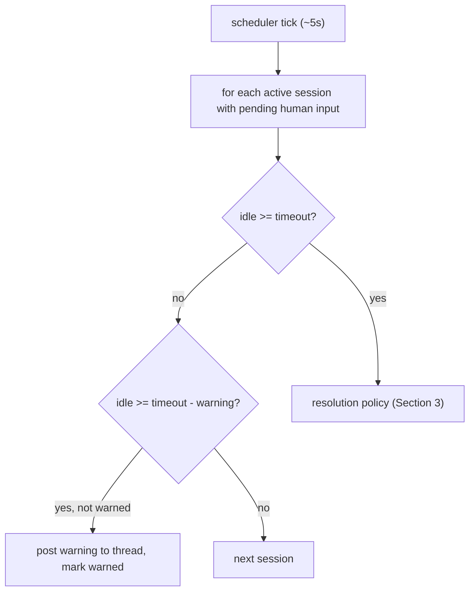
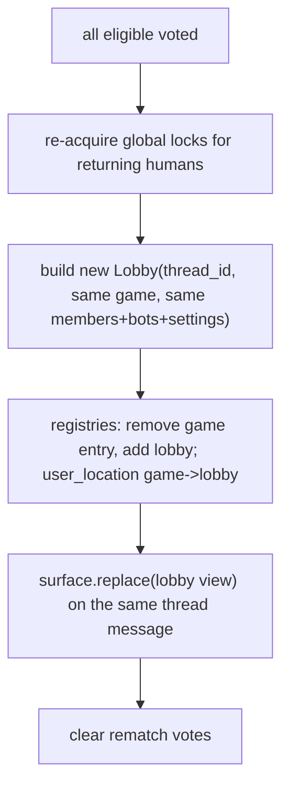

# 08 - Session Lifecycle: Timeouts, Forfeit & Rematch

Turn-timeout / AFK handling (Architecture section 5, Decision D10), user-initiated forfeit, and the unanimous in-place rematch (Decision D11). Depends on [06](06-game-engine-api.md) and [07](07-matchmaking-and-lobby.md).

---

## 1. LifecycleService - `strife/lifecycle/service.py`

A single service owns the background scheduler and the forfeit/rematch entrypoints, wired into the router ([05](05-interaction-routing.md)) and the `/strife forfeit` command ([09](09-commands.md)).

```python
class LifecycleService:
    def __init__(self, bot, registries: SessionRegistries, registry: GameRegistry,
                 lobby: LobbyService, text: TextConfig): ...
    def start(self) -> None                       # launch the AFK scheduler task (01 step 10)
    async def stop(self) -> None
    async def forfeit(self, thread_id: int, user_id: int) -> None
    async def register_rematch_vote(self, thread_id: int, user: discord.User) -> None
```

---

## 2. AFK / turn-timeout scheduler - `strife/lifecycle/timeout.py`

A periodic background task scans active sessions for stalled human inputs (Architecture section 5).

- Tick interval: ~5 s.
- Per game thresholds come from `games.yaml` merged defaults ([02](02-configuration-and-emoji.md)): `turn_timeout_seconds`, `turn_warning_seconds`.
- For each session with one or more `pending` human inputs:
  - `idle = now - session.last_move_at`.
  - If `idle >= turn_timeout - turn_warning` and no warning sent yet for this turn: broadcast a visual warning into the thread (a transient message or a banner text display) naming the player and remaining time; mark `warned`.
  - If `idle >= turn_timeout`: run the resolution policy (Section 3) for each stalled seat.

State per pending turn tracks whether a warning has been emitted so it fires once.



---

## 3. Resolution policy (Decision D10)

For a stalled seat `s` whose human controller timed out, resolve in this strict order:

1. **Bot hot-swap** - if `game.metadata.supports_bots`:
   - Mark the seat bot-controlled (`player.is_bot = True`, `player.bot_difficulty = afk_bot_difficulty` from config, default "hard").
   - Resolve the current pending input via `session.force_move(s, await game.bot_move(difficulty, s))`.
   - All subsequent turns for `s` auto-resolve as a bot ([06](06-game-engine-api.md) Section 7).
   - Release the original human's global lock (`registries.release_user`); record the seat's human result as `forfeit` for stats while the bot finishes the seat's gameplay so remaining players get a complete match.
2. **Forfeit-remove** - else if `game.metadata.supports_player_removal`:
   - `game.remove_player(s)`; inject a recorded `forfeit` move via `session.force_move`; the match continues with remaining players; release the human's lock; mark result `forfeit`.
3. **End game** - else:
   - `session.cancel("timeout")`: disable the board, finalize as `status='abandoned'` (storing recorded moves so a partial replay exists), release all locks.

All injected actions flow through `session.force_move` / `session.cancel`, so they are **recorded moves** and replay reproduces the resolution exactly ([06](06-game-engine-api.md) D12).

Stats note (default): an AFK-swapped or removed human is recorded as `forfeit` (counts as a loss in `user_game_stats`); the seat's continued bot play does not credit any user. This is the default product rule and is easy to revisit.

---

## 4. Forfeit - `/strife forfeit`

`LifecycleService.forfeit(thread_id, user_id)`:

1. Look up the active session by thread; reject if none or the caller is not a current player.
2. Resolve the caller's seat immediately:
   - 2-player game -> end with the opponent as winner.
   - multiplayer with `supports_player_removal` -> `game.remove_player(seat)` + recorded `forfeit` move; continue.
   - otherwise -> `session.cancel("forfeit")`.
3. Release the caller's global lock; update the board; finalize if the match ended.

Forfeit differs from AFK only in being user-initiated and immediate (no bot swap - the player chose to quit).

---

## 5. Rematch (Decision D11) - `strife/lifecycle/rematch.py`

In-place, unanimous, history-preserving (Architecture section 5 "Persistent Thread Lifecycle").

- When a match finalizes, the results view ([06](06-game-engine-api.md) completion) includes a **Rematch** button (`custom_id rematch:{thread_id}`).
- Eligible voters = the human players present at match end (excluding forfeited/AFK-swapped players).
- `register_rematch_vote(thread_id, user)`:
  1. Validate the user is an eligible voter; record their vote in a per-thread vote set.
  2. Update the results view to show vote progress (e.g. "Rematch 2/3").
  3. When **all** eligible voters have voted, reset the thread (Section 5.1).
  4. A vote window (e.g. 120 s) bounds the offer; on expiry, disable the Rematch button.

### 5.1 Thread reset routine

Rather than create a new thread/channel, reset the existing one to a fresh lobby (preserving chat history):



- The same `thread_id` (hence the same `ResourceID`) is reused; the lobby `ViewSurface` re-renders the section 6A view in place.
- Players who declined or left are simply not re-added (others may re-`Join` if seats remain).
- If a returning human is meanwhile placed elsewhere (global lock conflict), they are dropped from the rematch lobby with an ephemeral notice.

---

## 6. Results view (match end)

Posted by session completion ([06](06-game-engine-api.md)) into the thread:

```
## [success_checkmark] {game} - Result
Container(accent):
  TextDisplay: outcome summary (winner(s) / draw)
  Separator
  TextDisplay: per-seat results (roles revealed if applicable)
ActionRow:
  [Rematch]      custom_id rematch:{thread_id}
  [View Replay]  custom_id r_nav:{match_id} payload {frame:0, owner:<viewer>}  # opens replay (10)
```

The board itself is disabled (`surface.disable_all`) before the results view is appended.

---

## 7. Background task management

- The scheduler task is created in `setup_hook` step 10 ([01](01-foundation.md)) and cancelled in `close()`.
- It must never raise out of the loop: wrap each tick in try/except, log, and continue (a single bad session must not kill timeout handling for all others).

---

## 8. Deliverables checklist

- [ ] `strife/lifecycle/service.py` (`LifecycleService` with start/stop/forfeit/register_rematch_vote).
- [ ] `strife/lifecycle/timeout.py` (scheduler tick, warning emission, threshold logic).
- [ ] Resolution policy implementing the D10 order (swap -> remove -> end) via recorded moves.
- [ ] `strife/lifecycle/rematch.py` (vote tracking + in-place thread reset).
- [ ] Results view builder with Rematch + View Replay buttons.
- [ ] Scheduler wired into startup/shutdown; per-tick error isolation.
