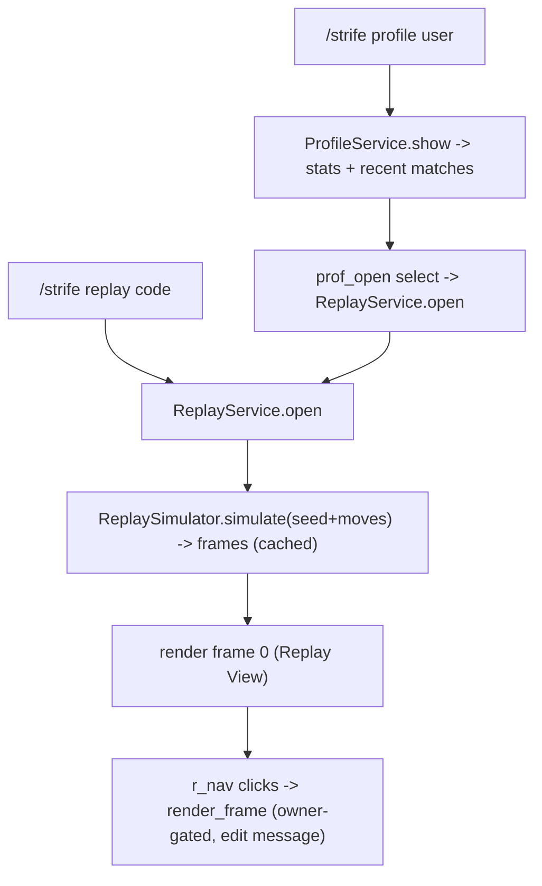

# 10 - Replay & Profile

Deterministic replay by re-simulation (Decision D12, Architecture section 6C) and the merged `/strife profile` (history + stats, no ELO per Decision D8). Depends on [03](03-persistence.md), [05](05-interaction-routing.md), [06](06-game-engine-api.md).

---

## 1. Replay by re-simulation

A finished match is stored as `seed` + `settings` + `match_players` + ordered `moves` ([03](03-persistence.md)). No rendered frames are persisted; instead the engine re-runs `game.play()` under a `ReplayContext` to regenerate every frame on demand.

### 1.1 ReplaySimulator - `strife/replay/simulator.py`

```python
@dataclass
class Frame:
    index: int               # 0-based frame ordinal
    turn_label: str          # e.g. "Turn 3 / 9" or phase label
    actor_seat: int | None
    view: LayoutView         # captured Strife view, all interactive items disabled

class ReplaySimulator:
    def __init__(self, registry: GameRegistry): ...
    async def simulate(self, match: MatchDetail, moves: list[MoveRecord]) -> list[Frame]:
        players = match.players                         # seats + roles from match_players
        game = self.registry.create(match.game_key, players, match.settings, match.seed)
        ctx = ReplayContext(rng=Random(match.seed), players=players,
                            settings=match.settings, moves=moves)
        await game.play(ctx)                            # never waits; pops recorded moves
        return ctx.frames
```

`ReplayContext` ([06](06-game-engine-api.md) section 5.2):

- `update` / `request_input` / `request_inputs` capture the rendered `LayoutView` (deep-copied, `disable_all` applied) as a `Frame`, then `request_input(s)` returns the next recorded move(s) in order.
- Because randomness is seeded identically and bot/AFK moves were recorded as concrete moves, the regenerated frames match the original match exactly.
- Safety: if a recorded move is illegal during re-simulation (corruption / engine drift), abort and surface a "replay unavailable" notice; log the match id and divergence point.

### 1.2 Frame cache

Re-simulation is cheap but not free; cache the `list[Frame]` per `match_id` in an in-memory LRU (e.g. 64 matches) inside `ReplayService`. Finished matches are immutable, so cache entries never need invalidation.

---

## 2. ReplayService - `strife/replay/service.py`

```python
class ReplayService:
    def __init__(self, matches: MatchRepository, moves: MoveRepository,
                 simulator: ReplaySimulator, compiler: Compiler, text: TextConfig): ...

    async def open(self, interaction, match_ref: str | int) -> None       # /strife replay
    async def render_frame(self, match_id: int, frame: int, interaction,
                           *, owner_id: int, seek: bool = False) -> None    # r_nav (05)
```

- `open`: resolve the match by id/code ([03](03-persistence.md)); if missing -> ephemeral "match not found". Simulate (or hit cache), then render frame 0 via the Replay View (Section 3) as a normal message in the channel, embedding the invoker as `owner` in the nav payloads. Also reachable from the match-end "View Replay" button ([08](08-session-lifecycle.md)) and the profile open-select (Section 4).
- `render_frame`: clamp `frame` to `[0, len-1]`; rebuild the Replay View for that frame; `await interaction.response.edit_message(view=compiled)`. Enforce the owner guard: only `owner_id` may navigate; others get an ephemeral "open your own replay with /strife replay".

---

## 3. Replay View (Architecture section 6C) - `strife/replay/view.py`

`build_replay_view(match, frame, total, emoji, text) -> LayoutView`:

```
## [brand_logo] Replay: Match #{code} ({game name})
Container(accent):
  TextDisplay: outcome / winner summary (from match.outcome)
  Separator
  TextDisplay: main board content for this frame (the frame's board text)
  Separator
  [frame's nested layout: the captured buttons/selects, all disabled]   # custom_id replay_noop:{mid}
ActionRow 1 (playback nav):
  [First  ⏮]  r_nav:{mid} payload {owner, frame:0}
  [Prev   ◀]  r_nav:{mid} payload {owner, frame:n-1}
  [Turn n/N]  disabled secondary (label only)        custom_id replay_noop:{mid}
  [Next   ▶]  r_nav:{mid} payload {owner, frame:n+1}
  [Last   ⏭]  r_nav:{mid} payload {owner, frame:N-1}
ActionRow 2 (seek, if total turns > 1):
  [Select "Jump directly to move..."]  r_nav:{mid} payload {owner, mode:seek}
    up to 25 bookmark turns evenly distributed across the timeline
```

- The captured frame components are rendered disabled; their `custom_id`s use a `replay_noop:` prefix which the router ignores (no-op) - a defensive measure since disabled components cannot normally be clicked.
- The seek select's chosen value carries the target frame; `render_frame(..., seek=True)` jumps to it.

### Routing additions ([05](05-interaction-routing.md))

Register `replay_noop:` (ignored) alongside the existing `r_nav:`. The router decodes `r_nav` payload `{owner, frame|mode}` and calls `ReplayService.render_frame`.

---

## 4. Merged Profile - `/strife profile [user] [game] [page]`

Combines the old profile + history (Decision: merged; no ELO per D8).

### ProfileService - `strife/replay/profile.py`

```python
class ProfileService:
    def __init__(self, users: UserRepository, matches: MatchRepository,
                 compiler: Compiler, text: TextConfig): ...
    async def show(self, interaction, user: discord.User, game: str | None, page: int) -> None
    async def navigate(self, interaction, route: Route) -> None   # prof_nav (05)
```

- `show`: gather `UserRepository.get_stats(user_id, game)` (wins/losses/draws/played; aggregate across games when `game` is None, else per-game) and `MatchRepository.list_for_user(user_id, game, limit, offset)`.
- Render the Profile View (below); paginate recent matches with a `prof_nav:` prefix (resource_id = target user id; payload `{game, page}`).
- Default ephemeral (a personal stats lookup), but visible to the invoker only; pagination works within the interaction.

### Profile View

```
## [brand_logo] {display_name} - Profile{ (game) }
Container(accent):
  TextDisplay: Wins W  •  Losses L  •  Draws D  •  Played P  •  Win rate XX%
  Separator
  TextDisplay: Recent Matches (page p / P)
    - #{code}  {game}  {result}  {date}  vs {opponents}
    ... (page size ~5-8)
ActionRow (pagination): [Prev] prof_nav payload {game,page-1}  [Page p/P disabled]  [Next] prof_nav payload {game,page+1}
ActionRow (open replay, optional): [Select "Open a replay..."]  prof_open:{user_id}
    choices = this page's match codes -> ReplayService.open
```

- Win rate = `wins / played` (guard divide-by-zero).
- The optional `prof_open:` select hands off to `ReplayService.open` for the chosen match, bridging profile -> replay.

---

## 5. Flow summary



---

## 6. Deliverables checklist

- [ ] `strife/replay/simulator.py` (`ReplaySimulator.simulate`, `Frame`, illegal-move safety).
- [ ] `ReplayContext` implemented in [06](06-game-engine-api.md) `context.py` (frame capture + recorded-move feed).
- [ ] `strife/replay/service.py` (`ReplayService.open` / `render_frame` + frame LRU cache + owner guard).
- [ ] `strife/replay/view.py` (section 6C Replay View incl. seek select + disabled frame components).
- [ ] `strife/replay/profile.py` (`ProfileService.show` / `navigate` + Profile View).
- [ ] Router additions: `r_nav` payload handling, `replay_noop` ignore, `prof_nav` / `prof_open` delegation ([05](05-interaction-routing.md)).
- [ ] Determinism test: simulate(match) twice -> identical frames; live match recorded-moves -> replay matches ([13](13-testing.md)).
