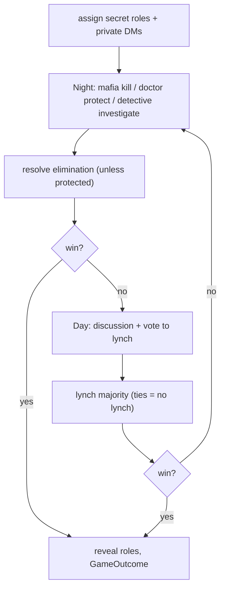

# 12 - Reference Game: Mafia

A hidden-role, phased social-deduction game that exercises the harder platform features: secret role assignment, per-player private views, simultaneous multi-actor input, player elimination/removal, and role-aware bots. Depends on [06](06-game-engine-api.md).

Location: `strife/games/mafia/` (`game.py`, `roles.py`, `bot.py`).

---

## 1. Registry metadata

```python
META = GameMetadata(
    key="mafia", name="Mafia",
    summary="Social deduction: town vs. hidden mafia.",
    description="Mafia secretly eliminate town members each night; town debates and lynches by day. "
                "Town wins by eliminating all mafia; mafia win at parity.",
    tags=("social", "deduction", "party"),
    author="Strife", version="1.0.0", author_link=None, source_link=None,
    time_estimate="20m", difficulty="medium",
    player_count=PlayerCount(minimum=4, maximum=12),
    player_order=PlayerOrder.RANDOM,
    bots=(BotSpec("easy", "Plays semi-randomly"),
          BotSpec("medium", "Tracks claims and votes plausibly"),
          BotSpec("hard", "Uses night results + voting history to reason")),
    settings=(
        SettingOption("mafia_count", "Mafia Count", "Number of mafia",
                      OptionType.INT, default=2, minimum=1, maximum=4),
        SettingOption("enable_doctor", "Doctor", "Include a Doctor (night protect)",
                      OptionType.BOOL, default=True),
        SettingOption("enable_detective", "Detective", "Include a Detective (night investigate)",
                      OptionType.BOOL, default=True),
    ),
    slash_moves=(),                              # actions are buttons/selects on private + public views
    role_mode=RoleMode.SECRET,                   # assigned randomly, hidden (06 roles)
    role_flow=RoleFlow.RANDOM,
    roles=(RoleSpec("villager", "Villager", "No night action. Find and lynch the mafia."),
           RoleSpec("mafia", "Mafia", "Each night, agree on one victim to eliminate."),
           RoleSpec("doctor", "Doctor", "Each night, protect one player from elimination."),
           RoleSpec("detective", "Detective", "Each night, learn one player's alignment.")),
    supports_player_removal=True,                # eliminations remove seats; game continues
    accent_color=0xED4245,
)
```

`supports_bots` is True, so AFK first hot-swaps to a bot ([08](08-session-lifecycle.md) D10); `supports_player_removal` powers in-game eliminations (and the forfeit-remove fallback if bots were ever absent).

---

## 2. Role assignment - `strife/games/mafia/roles.py`

At start, `assign_roles` ([06](06-game-engine-api.md) section 4) composes the role multiset from settings: `mafia_count` mafia, optional 1 doctor + 1 detective, remaining are villagers; shuffle onto seats with `ctx.rng` (seeded -> reproducible). Roles are `SECRET`: revealed only via `send_private` and at game end.

---

## 3. State & phase loop

```python
class Mafia(Game):
    metadata = META
    def __init__(self, players, settings, rng):
        super().__init__(players, settings, rng)
        self.alive: set[int] = {p.seat for p in players}
        self.role: dict[int, str] = {p.seat: p.role_key for p in players}
        self.day: int = 0
        self.history: list[dict] = []      # public log (eliminations, votes) - replay-safe

    async def play(self, ctx) -> GameOutcome:
        await self._send_role_dms(ctx)     # private role reveal
        while not (winner := self._winner()):
            self.day += 1
            await self._night(ctx)
            if (winner := self._winner()): break
            await self._day(ctx)
        return self._finish(ctx, winner)
```



### 3.1 Night (`_night`)

- Send each acting role its private action UI via `ctx.send_private(seat, view)`:
  - Mafia: Select "Choose a victim" (source `kill`, choices = alive non-mafia).
  - Doctor (if enabled, alive): Select "Protect" (source `protect`, choices = alive).
  - Detective (if enabled, alive): Select "Investigate" (source `investigate`, choices = alive others).
- `await ctx.request_inputs(public_night_view, actors=acting_seats, sources={"kill","protect","investigate"}, until="all")`; each actor resolves from their private message (or a bot via `bot_move`). The public night view is ambiance ("Night falls on day N...").
- Mafia target resolution: aggregate mafia `kill` votes (majority; `rng` tie-break). Detective privately receives the investigated player's alignment via a follow-up `send_private`. Resolve elimination: if the victim != doctor's protected seat, `self.alive.discard(victim)` and `self.remove_player(victim)`.

### 3.2 Day (`_day`)

- `_day_view` shows day number, alive roster, dead roster (no roles), and a vote Select (source `vote`, choices = alive players + "skip").
- `votes = await ctx.request_inputs(day_view, actors=self.alive, sources={"vote"}, until="all")`; humans pick on the shared message, bots via `bot_move`. Update a running tally in the public view as votes arrive.
- Tally: the seat with the strict majority is lynched (`remove_player`); ties or majority-`skip` -> no lynch. Append to `self.history`.

### 3.3 Win conditions (`_winner`)

- Town wins when no mafia remain alive.
- Mafia wins when `mafia_alive >= non_mafia_alive` (parity).
- Otherwise continue.

### 3.4 Finish (`_finish`)

Reveal all roles in the final public view; build `GameOutcome` with `results` per seat (`win` for the victorious faction's members, `loss` otherwise; eliminated players keep their faction result) and a `summary` containing the winning faction and the full role map.

---

## 4. `remove_player`

```python
def remove_player(self, seat: int) -> None:
    self.alive.discard(seat)
```

Used by in-game eliminations and by the lifecycle forfeit/AFK fallback ([08](08-session-lifecycle.md)). The match continues with remaining seats; win conditions re-evaluate.

---

## 5. Private views (secret roles)

- `_send_role_dms` sends each player a private `LayoutView` naming their role + instructions (`RoleSpec.instructions`).
- Night action UIs are private per role; mafia additionally see their teammates.
- Per [06](06-game-engine-api.md) section 5.2, `send_private` frames are captured for replay but the public replay shows public frames; the final reveal frame exposes roles for the replay viewer.

---

## 6. Bots - `strife/games/mafia/bot.py` (Decision D13, "strong" = bounded heuristic)

`Game.bot_move(difficulty, seat)` branches on the current phase/pending action (the game is stateful, so the bot reads `self.day`, `self.alive`, `self.role[seat]`, and accumulated `self.history`). All randomness uses `self.rng`.

- Night:
  - Mafia bot: target town; prioritize a suspected detective/doctor; coordinate via a deterministic shared rule so mafia converge.
  - Doctor bot: protect a likely target (self/detective/active town), scaling cleverness with difficulty.
  - Detective bot: investigate the most informative unknown; remember results.
- Day vote:
  - Maintain a per-seat suspicion score from night outcomes and prior votes; vote for the highest-suspicion non-self (mafia bots steer away from teammates and blend in).
- Difficulty scaling: `easy` adds heavy randomness and ignores history; `medium` uses simple claim/vote tracking; `hard` uses night results + voting history for sharper inference. This is a strong **bounded** heuristic, not a full opponent-modeling AI (called out in Decision D13).

```python
async def bot_move(self, difficulty, seat) -> Move:
    if self._phase == "night":
        return await asyncio.to_thread(self._night_move, difficulty, seat)
    return await asyncio.to_thread(self._vote_move, difficulty, seat)   # day
```

Returned `Move.source` is `kill`/`protect`/`investigate`/`vote` with `args={"target": <seat or 'skip'>}`.

---

## 7. Determinism & replay

- Role assignment, mafia tie-breaks, and bot randomness all use `self.rng` (seeded by the match seed).
- Every action (mafia kill, protect, investigate, vote - human and bot) is recorded as a concrete `Move`; replay re-runs `play()` and reproduces phases, eliminations, and the final reveal identically ([10](10-replay-and-profile.md)). Detective results are derived deterministically from the (recorded) role map, so no hidden state escapes the seed+moves model.

---

## 8. Deliverables checklist

- [ ] `strife/games/mafia/roles.py` (role-multiset composition from settings).
- [ ] `strife/games/mafia/game.py` (`Mafia`: state, `play`, `_night`, `_day`, win check, reveal, `remove_player`, private views).
- [ ] `strife/games/mafia/bot.py` (`bot_move`: night + vote heuristics, difficulty scaling).
- [ ] Registered in `GameRegistry` at startup ([01](01-foundation.md) step 6).
- [ ] Tests: role composition, night/day resolution, win conditions, removal mid-match, full-game determinism/replay ([13](13-testing.md)).
